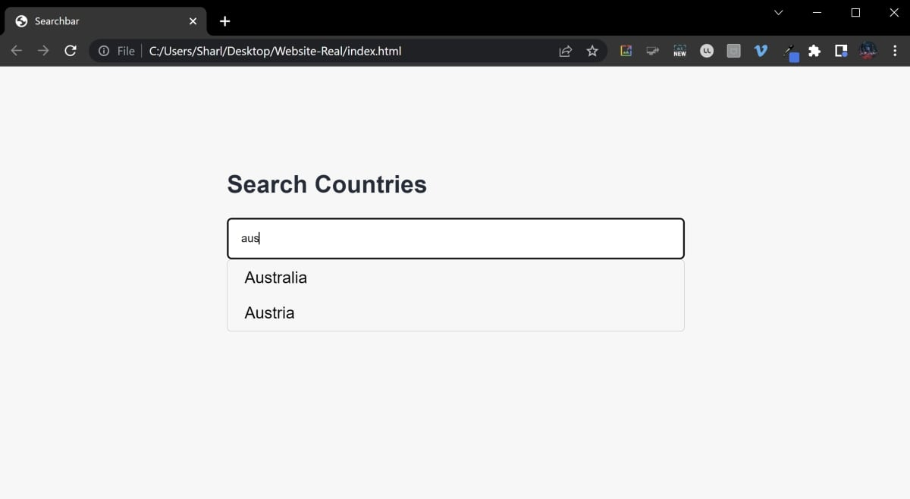

# javascript-searchbar

This is for the MUO guide on [How to Make a Simple Searchbar Using a List of Strings in JavaScript](https://www.makeuseof.com/javascript-searchbar-simple-using-list-strings/).

The project consists of:
* index.html - UI for the searchbar input
* script.js - Functionality to generate a list of countries. Hides and shows items in the list based on what the user types in the searchbar.
* styles.css - Styling for the search UI

## To Run

* Click on the index.html file to open it in a web browser
* Start typing into the searchbar. As you type, the list of results will update to only display matching results.

## Example

